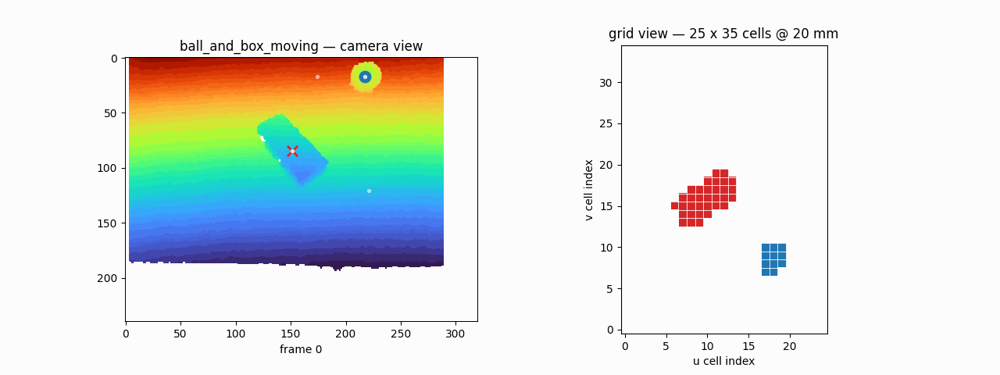
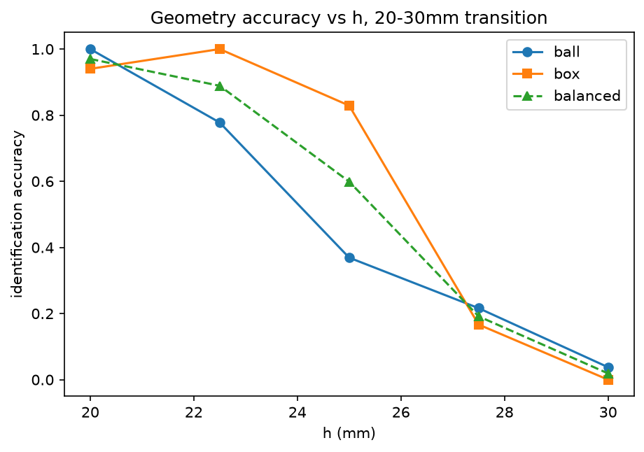
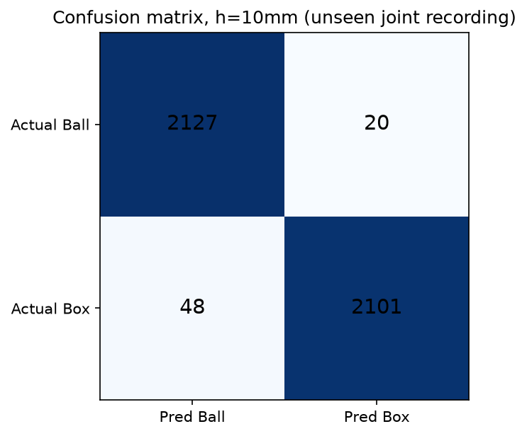
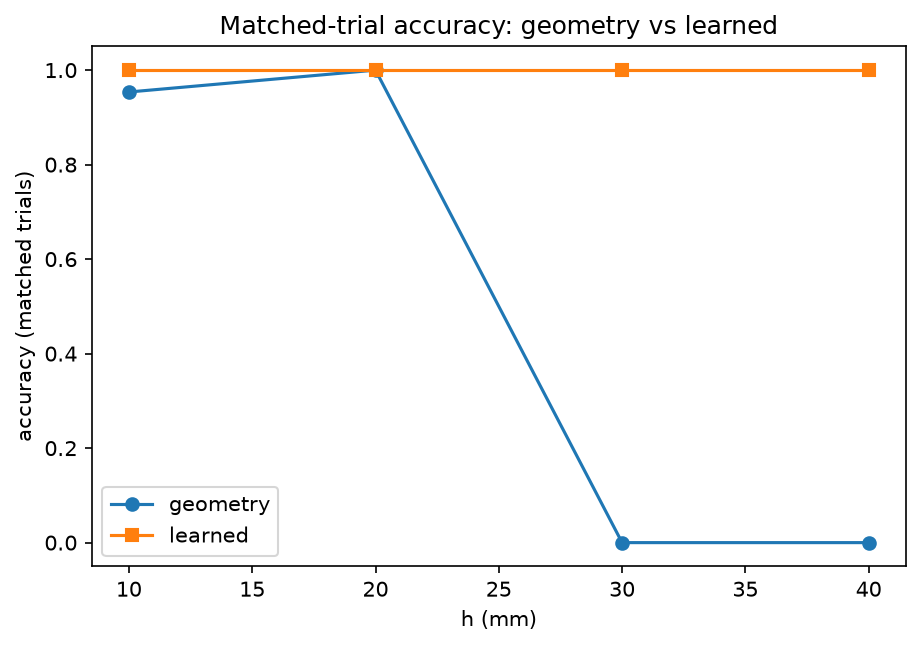
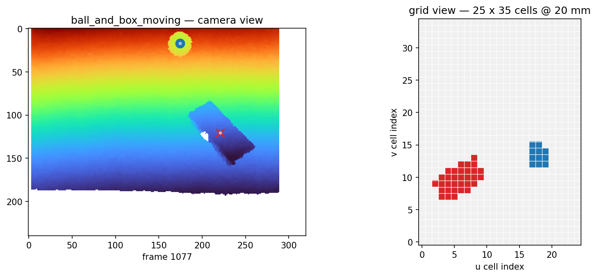
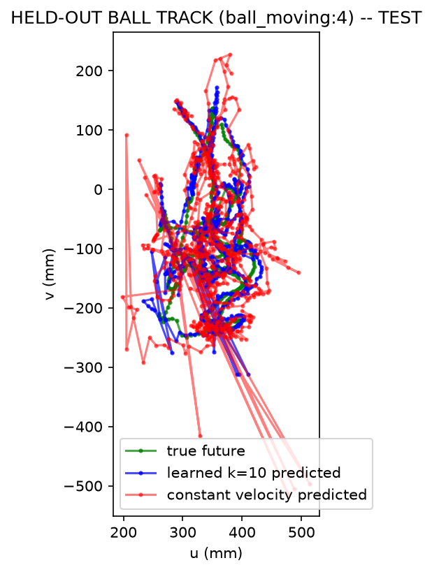
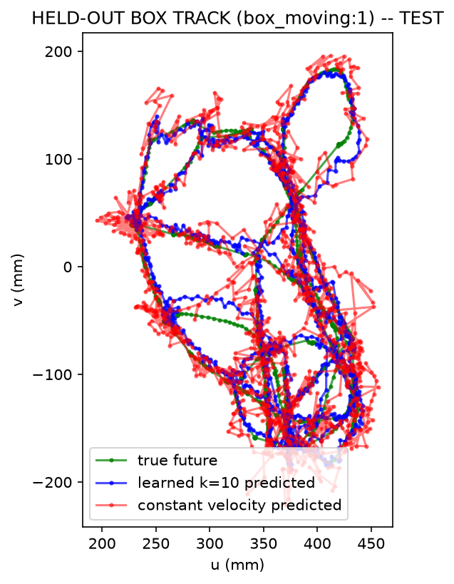
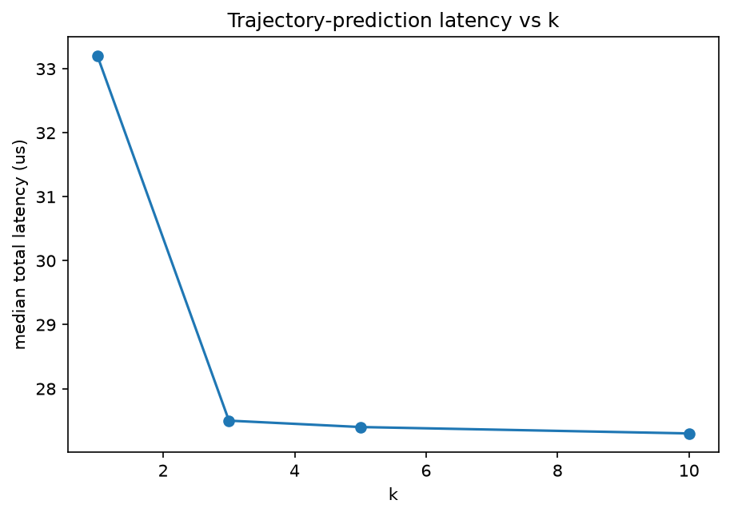

# Sparse-Depth Object Tracking: A Proof of Concept Toward Radar/mmWave Sensing

**Can a learned model still tell a ball from a box after explicit geometry has run out of spatial information to work with?**

Depth-camera-based detection, tracking, geometric identification, learned classification, and multi-frame trajectory prediction of tabletop objects — probing what happens as spatial resolution is coarsened toward future sparse radar/mmWave sensing. Part of ongoing doctoral research at the University of South Carolina.



*Two objects tracked through physical contact — shape-aware merge splitting preserves both identities while they touch.*

---

## 1. Research question

As the spatial cell size `h` used to represent an object gets coarser, at what point does **explicit geometric identification** of a known shape (sphere vs. box) fail — and does a **learned classifier**, given the same underlying spatial information, retain discriminative power past that point?

## 2. Motivation: a depth-camera proof of concept toward future radar/mmWave sensing

Real, low-cost mmWave radar arrays produce far sparser spatial data than a depth camera. Before committing to specific radar hardware, this project uses a depth camera as a **controllable testbed**: by discretizing depth-derived point clouds into cells of size `h`, we can simulate a spectrum of spatial resolutions and ask, on real data, which identification strategies survive coarsening and which don't.

**`h` is a depth-derived simulated spatial cell size. It is not yet a validated physical radar-resolution specification** — that mapping is future work (Section 19).

## 3. Experimental setup and recordings

Six PrimeSense `.oni` recordings (320×240 @ 30 fps, depth only), extracted via the Docker/OpenNI2 tooling in `extraction_tools/`: an empty-table reference, a static ball, a static box, a moving ball, a moving box, and both objects moving together (`ball_and_box_moving`). Sensor noise measured at 0.77 mm; ball diameter 60.66 ± 0.64 mm; box 133.1 × 57.3 × 35.3 mm — both cross-checked against physical ruler measurement.

## 4. End-to-end system architecture

```
depth frame → background subtraction → 3D backprojection → table-plane coordinates
   → spatial cell discretization (size h) → object clustering
   → [geometric fit: sphere vs. plane-set] OR [learned classifier: patch features]
   → Kalman-filtered tracking → multi-frame trajectory feature window → future-position prediction
```

Two parallel identification paths are compared throughout this work: a **geometric path** (no learning, RANSAC sphere/plane-set competing fits) and a **learned path** (logistic regression on an object-centered spatial patch).

## 5. Geometry-based identification

At full resolution, geometry identifies both objects reliably. At `h = 20 mm`, balanced identification accuracy is **97.01%** (ball 100.00%, box 94.02%), measured directly on real `ball_static`/`box_static` data via the unmodified production geometry pipeline.

## 6. Geometry resolution transition

A fine sweep between 20 mm and 30 mm reveals exactly where geometric identification collapses:

| h (mm) | Ball ID | Box ID | Balanced ID |
|---:|---:|---:|---:|
| 20.0 | 100.00% | 94.02% | 97.01% |
| 22.5 | 77.78% | 100.00% | 88.89% |
| 25.0 | 36.90% | 82.91% | 59.91% |
| 27.5 | 21.63% | 16.67% | 19.15% |
| 30.0 | 3.77% | 0.00% | 1.88% |



The largest measured single-step decline in balanced accuracy occurs between **h = 25 mm and h = 27.5 mm**, coinciding with degrading sphere/box fit validity and occupied-cell spatial support at the same resolutions (see `final_results/geometry/transition/`).

## 7. Learned ball-vs-box classification

A deliberately explainable plain-numpy logistic regression, trained per resolution (`h = 10, 20, 30, 40 mm`) on the existing object-centered 13×13 spatial patch representation extracted from the discretized cell grid.

## 8. Independent unseen-recording evaluation

The frozen learned classifier — trained only on `ball_static`, `ball_moving`, `box_static`, and `box_moving` — was evaluated on the completely separate `ball_and_box_moving` recording, excluded from training entirely:

| h (mm) | Unseen-recording accuracy |
|---:|---:|
| 10 | 98.42% |
| 20 | 98.11% |
| 30 | 98.14% |
| 40 | 97.49% |



Accuracy stays high **even at h = 30–40 mm, where geometry has already collapsed** (Section 6).

## 9. Matched clean unseen geometry-vs-learned comparison

A **small, explicitly diagnostic** experiment: the same real frames, at the same `h`, given to both methods, restricted to frames the learned classifier never saw during training (N = 32 per h — read this as indicative, not high-powered statistical evidence):

| h (mm) | Clean unseen N | Geometry accuracy | Learned accuracy |
|---:|---:|---:|---:|
| 10 | 32 | 93.75% | 100.00% |
| 20 | 32 | 100.00% | 100.00% |
| 30 | 32 | 0.00% | 100.00% |
| 40 | 32 | 0.00% | 100.00% |



**This is a separate, smaller experiment from Section 8's independent unseen-recording result — the two should not be conflated.** Section 8 is the stronger generalization evidence; this section is a complementary diagnostic about what each *representation* retains at each `h`.

## 10. Tracking

Kalman filter with measured process/measurement noise, Mahalanobis-gated association, and shape-aware merge-splitting: when two tracked objects touch, their points are divided by distance to each track's predicted *body* (not center), preserving both identities through contact.



## 11. Multi-frame trajectory prediction

A ridge-regularized multivariate linear regression predicts future displacement `(Δu, Δv)` from a `k`-frame window of recent position/velocity history. Model selection used a genuinely **track-independent** train/validation/test split (not merely a time-split within the same tracks): `k = 10, horizon = 10` was selected using VALIDATION performance, **before TEST was ever opened**.

Final locked TEST result (N = 1854):

| Metric | Learned k=10 | Constant velocity | Improvement |
|---|---:|---:|---:|
| Mean | 18.15 mm | 22.14 mm | +18.0% |
| Median | 13.69 mm | 15.86 mm | +13.7% |
| RMSE | 24.24 mm | 33.51 mm | +27.7% |
| P90 | 36.44 mm | 43.73 mm | +16.7% |
| P95 | 47.34 mm | 60.10 mm | +21.2% |

| Object | Learned median | CV median | Improvement |
|---|---:|---:|---:|
| ball | 23.06 mm | 25.21 mm | 8.6% |
| box | 10.35 mm | 13.01 mm | 20.4% |




**Ball trajectory prediction is consistently harder than box** in this final test. The BOX test track is both track- *and* recording-independent (drawn from a recording, `box_moving`, never touched during train/validation); the BALL test track is track-independent only — other `ball_moving` tracks did appear in train/validation.

## 12. Computational profile

Characterization of the trajectory predictor alone — **not the full depth-to-prediction pipeline** (backprojection, RANSAC fitting, discretization, and Kalman tracking are all upstream and unmeasured here):

| Quantity | Value |
|---|---:|
| Learned parameters | 20 |
| Raw parameter memory (W+b) | 160 bytes |
| Total inference-state memory (incl. normalization) | 232 bytes |
| History-buffer memory (k=10) | 400 bytes |
| Scalar operations per prediction | 88 |
| Model matvec MACs | 18 |
| Measured median total latency | 27.30 µs |
| Meets nominal 30-FPS predictor-only requirement | Yes |



## 13. Validation methodology

The final results were supported by a dedicated validation suite covering geometry reconstruction, dataset construction, trajectory-window alignment, model/data compatibility, deterministic repeatability, matched comparisons, held-out-track evaluation, and computational profiling.

## 14. Key findings

- Explicit geometric identification is strong near h = 20 mm and degrades sharply toward h = 30 mm, with the largest measured single-step decline between 25 mm and 27.5 mm.
- The learned classifier generalizes to a completely separate recording (97.5–98.4% across h = 10–40 mm) and, in a smaller matched diagnostic, retains discrimination at resolutions where explicit geometry has already collapsed.
- A track-independent, VALIDATION-selected trajectory model (k=10) beats constant velocity across every reported metric on a genuinely held-out test set.
- The trajectory predictor itself is tiny (20 parameters, ~27 µs/prediction) and comfortably meets a nominal 30-FPS requirement — for the predictor alone.

## 15. Repository structure

```
particleTracking/
├── config.py, geometry.py, discretize.py, fit_static.py, tracking.py,
│   merge_split.py, heightfit.py, track_moving.py, build_reference.py,
│   extract_oni.py, probe_oni.py, make_dataset.py, make_dataset2.py,
│   train_model.py, train_model2.py, eval_model.py, eval_uw.py,
│   uw_adapter.py, sweep.py, predict.py, plot.py, plot_sweep_mm.py,
│   selftest.py                          <- core production, kept at root
│                                            (bare cross-imports / hardcoded
│                                            Data/ paths; must stay co-located)
├── validation/                          <- audit/validation suite
├── experiments/                         <- final joint-test + held-out
│                                            trajectory experiment scripts
├── archive/old_splits/                  <- superseded split proposals
├── results/                             <- generated data (untouched by reorg)
├── validation_results/                  <- audit trail (untouched by reorg)
├── final_results/                       <- presentation-ready summary
├── assets/                              <- figures, incl. assets/final_results/
└── README.md
```

## 16. How to reproduce the main experiments

```
python3 build_reference.py
python3 fit_static.py
python3 track_moving.py ball_moving
python3 track_moving.py box_moving
python3 track_moving.py ball_and_box_moving
python3 make_dataset.py && python3 train_model.py && python3 eval_model.py
python3 make_dataset2.py --k 10 --h 10 && python3 train_model2.py --k 10 --h 10
python3 experiments/make_joint_test_dataset.py --inspect   # then with real track IDs
python3 experiments/evaluate_joint_test.py

# final held-out trajectory experiment (the approved, locked split):
python3 experiments/make_heldout_trajectory_dataset.py --split heldout_track_split.json
python3 experiments/train_heldout_trajectory.py
python3 experiments/evaluate_heldout_trajectory_test.py
```

`make_heldout_trajectory_dataset.py --plan` is an optional utility for proposing/reviewing a new track split — it is not part of reproducing the final, already-approved experiment above.

Requirements: Python 3.9+, `pip3 install numpy scipy matplotlib pillow`.

## 17. Limitations

- `h` is a depth-camera-derived simulated spatial cell size, **not a validated physical radar-resolution specification**.
- Geometry (Sections 5–6) and the independent unseen-recording learned result (Section 8) are not always evaluated on identical populations; the sample-matched evidence lives in Section 9 and should not be conflated with Section 8.
- The clean matched comparison (Section 9) uses a small sample (32 trials per h) — indicative, not high-powered statistical evidence.
- Ball trajectory prediction is harder than box in the final held-out test.
- Final trajectory testing is track-independent; the ball test track is not fully recording-independent, while the box test track is both track- and recording-independent.
- The measured latency (Section 12) covers the trajectory-prediction component alone, not the full depth-to-prediction pipeline.
- **These results do not demonstrate that a cheaper radar is sufficient.**

## 18. Next step toward radar hardware

This work identifies a **potential sensing-resolution versus algorithmic-capability trade space** — not a radar specification. The motivated next step is mapping the observed depth-derived spatial requirements onto realistic radar hardware characteristics: range resolution, angular resolution, cross-range resolution, aperture, bandwidth, antenna/virtual-channel configuration, operating distance, and computational/hardware cost. Interpreting `h = 20 mm` as directly meaning "20 mm radar resolution," or `h = 40 mm` as proof a cheaper radar suffices, would be premature without that dedicated validation.